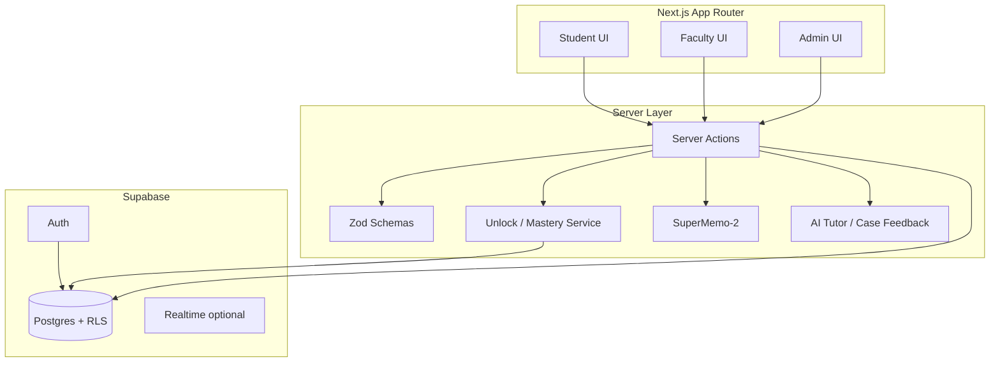
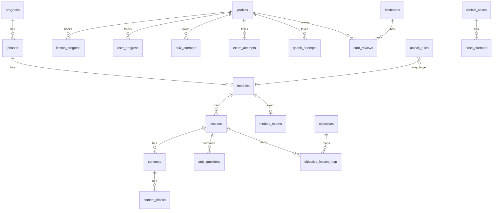

# Online MD Curriculum Platform — Implementation Plan

**Decisions locked in**

| Topic | Choice |
| --- | --- |
| Tenancy | Single institution, one MD program |
| Auth | Supabase email/password; faculty/admin invite-only |
| AI (v1) | Student-facing tutor + clinical case feedback (Zod-validated) |
| Media | External URLs only (YouTube/Vimeo/Mux/etc.) |
| Surfaces | Student + faculty editor + admin analytics in the same build track |

**Pedagogical rule:** Content-first. Lessons and mastery gates unlock USMLE Qbank. Qbank is assessment, not primary instruction. No invented medical content — placeholder seed data only.

---

## 1. Architecture Overview



**Stack**

- Next.js 15 App Router, TypeScript, Tailwind CSS, shadcn/ui
- Supabase (Auth, Postgres, RLS); hosted on Vercel
- Server Actions for all mutations; Zod for forms + AI I/O
- OpenAI-compatible API (env-configured) for student tutor and case feedback

**Content hierarchy**

`Program → Phase → Module → Lesson → Concept → ContentBlock`  
`Objective` tagged to USMLE axes; linked to lessons via `objective_lesson_map`.

**Progress states:** `not_started` | `in_progress` | `completed` | `mastered`

**Mastery gates (enforced in `lib/mastery/` and Server Actions, not UI alone)**

| Gate | Rule |
| --- | --- |
| Lesson mastered | All content blocks viewed + ≥80% formative quiz |
| Module mastered | All lessons mastered + ≥70% module exam |
| Module Qbank | Unlocked only when module is mastered |
| Step 1 Qbank | Unlocked after all Phase 1 modules mastered |
| Step 2 CK Qbank | Unlocked after all core clerkship modules mastered |

---

## 2. Repository Layout

```
/
├── app/
│   ├── (auth)/
│   │   ├── login/page.tsx
│   │   ├── signup/page.tsx              # students only (public signup)
│   │   ├── invite/[token]/page.tsx      # faculty/admin accept invite
│   │   └── callback/route.ts            # Supabase auth callback
│   ├── (student)/
│   │   ├── layout.tsx
│   │   ├── dashboard/page.tsx
│   │   ├── modules/[moduleId]/page.tsx
│   │   ├── lessons/[lessonId]/page.tsx   # lesson player
│   │   ├── lessons/[lessonId]/quiz/page.tsx
│   │   ├── flashcards/page.tsx
│   │   ├── modules/[moduleId]/exam/page.tsx
│   │   ├── qbank/page.tsx
│   │   ├── qbank/[attemptId]/page.tsx
│   │   ├── cases/[caseId]/page.tsx
│   │   └── tutor/page.tsx               # AI tutor chat
│   ├── (faculty)/
│   │   ├── layout.tsx                   # role gate: faculty | admin
│   │   ├── page.tsx                     # content library
│   │   ├── modules/[moduleId]/edit/page.tsx
│   │   ├── lessons/[lessonId]/edit/page.tsx
│   │   ├── questions/page.tsx
│   │   ├── cases/[caseId]/edit/page.tsx
│   │   └── invites/page.tsx             # faculty can view; admin sends
│   ├── (admin)/
│   │   ├── layout.tsx                   # role gate: admin
│   │   ├── analytics/page.tsx
│   │   ├── users/page.tsx
│   │   ├── unlock-rules/page.tsx
│   │   └── invites/page.tsx
│   ├── api/
│   │   └── health/route.ts
│   ├── layout.tsx
│   └── page.tsx                         # marketing / redirect by role
├── components/
│   ├── ui/                              # shadcn primitives
│   ├── student/
│   │   ├── progress-ring.tsx
│   │   ├── next-lesson-card.tsx
│   │   ├── lesson-sidebar.tsx
│   │   ├── content-block-renderer.tsx
│   │   ├── quiz-runner.tsx
│   │   ├── flashcard-deck.tsx
│   │   ├── exam-runner.tsx
│   │   ├── qbank-runner.tsx
│   │   ├── qbank-lock-banner.tsx
│   │   ├── case-player.tsx
│   │   └── tutor-chat.tsx
│   ├── faculty/
│   │   ├── content-tree.tsx
│   │   ├── lesson-editor-form.tsx
│   │   ├── block-editor.tsx
│   │   ├── objective-tagger.tsx
│   │   └── question-editor.tsx
│   ├── admin/
│   │   ├── analytics-charts.tsx
│   │   ├── user-table.tsx
│   │   └── unlock-rule-form.tsx
│   └── shared/
│       ├── app-shell.tsx
│       ├── role-badge.tsx
│       └── empty-state.tsx
├── lib/
│   ├── supabase/
│   │   ├── client.ts                    # browser
│   │   ├── server.ts                    # server components / actions
│   │   ├── admin.ts                     # service role (invites only)
│   │   └── middleware.ts
│   ├── auth/
│   │   ├── roles.ts
│   │   ├── require-role.ts
│   │   └── invites.ts
│   ├── mastery/
│   │   ├── lesson.ts
│   │   ├── module.ts
│   │   ├── qbank-gates.ts
│   │   └── unlock-evaluator.ts
│   ├── spaced-repetition/
│   │   └── supermemo2.ts
│   ├── ai/
│   │   ├── client.ts
│   │   ├── tutor.ts
│   │   ├── case-feedback.ts
│   │   └── schemas.ts                   # Zod for AI outputs
│   ├── validations/
│   │   ├── auth.ts
│   │   ├── content.ts
│   │   ├── quiz.ts
│   │   ├── progress.ts
│   │   └── admin.ts
│   ├── types/
│   │   ├── database.ts                  # generated from Supabase
│   │   └── domain.ts
│   └── utils.ts
├── actions/
│   ├── auth.ts
│   ├── progress.ts
│   ├── quizzes.ts
│   ├── flashcards.ts
│   ├── exams.ts
│   ├── qbank.ts
│   ├── cases.ts
│   ├── tutor.ts
│   ├── content.ts                       # faculty CRUD
│   ├── invites.ts
│   └── analytics.ts
├── supabase/
│   ├── migrations/
│   │   ├── 00001_extensions.sql
│   │   ├── 00002_enums.sql
│   │   ├── 00003_profiles_programs.sql
│   │   ├── 00004_curriculum.sql
│   │   ├── 00005_objectives.sql
│   │   ├── 00006_progress.sql
│   │   ├── 00007_quizzes_exams.sql
│   │   ├── 00008_flashcards.sql
│   │   ├── 00009_qbank.sql
│   │   ├── 00010_unlock_rules.sql
│   │   ├── 00011_clinical_cases.sql
│   │   ├── 00012_invites_ai.sql
│   │   ├── 00013_rls.sql
│   │   └── 00014_seed_placeholders.sql
│   ├── seed.sql
│   └── config.toml
├── middleware.ts                        # session refresh + route protection
├── docs/
│   └── IMPLEMENTATION_PLAN.md           # this file
├── .env.example
├── package.json
├── tailwind.config.ts
├── components.json                      # shadcn
└── README.md
```

---

## 3. Database Schema

### 3.1 Enums

```sql
create type user_role as enum ('student', 'faculty', 'admin');
create type progress_state as enum ('not_started', 'in_progress', 'completed', 'mastered');
create type content_block_type as enum (
  'video', 'reading', 'diagram', 'audio', 'clinical_vignette', 'formative_question'
);
create type usmle_step as enum ('step1', 'step2ck');
create type attempt_status as enum ('in_progress', 'submitted', 'abandoned');
create type unlock_scope as enum (
  'module_qbank', 'phase_step1_qbank', 'clerkship_step2_qbank', 'custom'
);
create type invite_status as enum ('pending', 'accepted', 'revoked', 'expired');
create type publish_status as enum ('draft', 'published', 'archived');
```

### 3.2 Core identity & program

**`profiles`** (1:1 with `auth.users`)

| Column | Type | Notes |
| --- | --- | --- |
| `id` | uuid PK | `= auth.users.id` |
| `email` | text unique not null | |
| `full_name` | text | |
| `role` | `user_role` not null default `student` | role changes via service role / admin only |
| `cohort_year` | int | optional |
| `avatar_url` | text | |
| `created_at` / `updated_at` | timestamptz | |

Trigger: on `auth.users` insert → create `profiles` row with `role = student` unless invite metadata specifies faculty/admin.

**`invites`**

| Column | Type | Notes |
| --- | --- | --- |
| `id` | uuid PK | |
| `email` | text not null | |
| `role` | `user_role` check in (`faculty`,`admin`) | |
| `token_hash` | text unique not null | |
| `status` | `invite_status` | |
| `invited_by` | uuid → profiles | |
| `expires_at` | timestamptz | |
| `accepted_at` | timestamptz | |

**`programs`**

| Column | Type | Notes |
| --- | --- | --- |
| `id` | uuid PK | single seed row |
| `name` | text | e.g. "MD Curriculum (Placeholder)" |
| `slug` | text unique | |
| `description` | text | |

**`phases`**

| Column | Type | Notes |
| --- | --- | --- |
| `id` | uuid PK | |
| `program_id` | uuid → programs | |
| `name` | text | e.g. "Phase 1 — Foundations" |
| `slug` | text | |
| `sequence` | int | |
| `phase_kind` | text | `foundations` \| `clerkship_core` \| `advanced` |
| `usmle_focus` | `usmle_step` nullable | |

### 3.3 Curriculum hierarchy

**`modules`** (Course/Module)

| Column | Type | Notes |
| --- | --- | --- |
| `id` | uuid PK | |
| `phase_id` | uuid → phases | |
| `title` | text | |
| `slug` | text | |
| `sequence` | int | |
| `description` | text | |
| `is_core_clerkship` | boolean default false | used for Step 2 CK gate |
| `status` | `publish_status` | |
| `exam_pass_threshold` | numeric default 0.70 | |

**`lessons`**

| Column | Type | Notes |
| --- | --- | --- |
| `id` | uuid PK | |
| `module_id` | uuid → modules | |
| `title` | text | |
| `slug` | text | |
| `sequence` | int | |
| `estimated_minutes` | int | |
| `status` | `publish_status` | |
| `quiz_pass_threshold` | numeric default 0.80 | |

**`concepts`**

| Column | Type | Notes |
| --- | --- | --- |
| `id` | uuid PK | |
| `lesson_id` | uuid → lessons | |
| `title` | text | |
| `sequence` | int | |
| `summary` | text | placeholder prose |

**`content_blocks`**

| Column | Type | Notes |
| --- | --- | --- |
| `id` | uuid PK | |
| `concept_id` | uuid → concepts | |
| `block_type` | `content_block_type` | |
| `title` | text | |
| `sequence` | int | |
| `body_md` | text | readings / vignettes |
| `media_url` | text | external URL for video/audio/diagram |
| `media_provider` | text | `youtube` \| `vimeo` \| `mux` \| `other` |
| `duration_seconds` | int | |
| `metadata` | jsonb | captions URL, poster, etc. |

**`objectives`**

| Column | Type | Notes |
| --- | --- | --- |
| `id` | uuid PK | |
| `code` | text unique | e.g. `OBJ-P1-CV-001` |
| `statement` | text | placeholder learning objective |
| `usmle_step` | `usmle_step` not null | |
| `organ_system` | text not null | controlled vocab in app Zod |
| `physician_task` | text not null | |
| `content_category` | text not null | |
| `module_id` | uuid → modules nullable | owning module |

**`objective_lesson_map`**

| Column | Type | Notes |
| --- | --- | --- |
| `objective_id` | uuid | PK composite |
| `lesson_id` | uuid | PK composite |
| `weight` | numeric default 1 | |

### 3.4 Progress

**`user_progress`** (module / phase rollups)

| Column | Type | Notes |
| --- | --- | --- |
| `id` | uuid PK | |
| `user_id` | uuid → profiles | |
| `module_id` | uuid → modules nullable | |
| `phase_id` | uuid → phases nullable | |
| `state` | `progress_state` | |
| `percent_complete` | numeric | |
| `mastered_at` | timestamptz | |
| unique `(user_id, module_id)` / `(user_id, phase_id)` | | partial uniques |

**`lesson_progress`**

| Column | Type | Notes |
| --- | --- | --- |
| `id` | uuid PK | |
| `user_id` | uuid → profiles | |
| `lesson_id` | uuid → lessons | |
| `state` | `progress_state` | |
| `blocks_viewed` | uuid[] or join table | prefer join |
| `last_formative_score` | numeric | 0–1 |
| `mastered_at` | timestamptz | |
| `started_at` / `updated_at` | timestamptz | |
| unique `(user_id, lesson_id)` | | |

**`content_block_views`** (supports “all blocks viewed”)

| Column | Type | Notes |
| --- | --- | --- |
| `user_id` | uuid | PK composite |
| `content_block_id` | uuid | PK composite |
| `viewed_at` | timestamptz | |
| `seconds_watched` | int | for video/audio |

### 3.5 Quizzes & module exams

**`quiz_questions`**

| Column | Type | Notes |
| --- | --- | --- |
| `id` | uuid PK | |
| `lesson_id` | uuid → lessons | formative quiz ownership |
| `stem` | text | placeholder |
| `choices` | jsonb | `[{id, text}]` |
| `correct_choice_id` | text | |
| `explanation` | text | placeholder |
| `objective_id` | uuid nullable | |
| `sequence` | int | |
| `is_active` | boolean | |

**`quiz_attempts`**

| Column | Type | Notes |
| --- | --- | --- |
| `id` | uuid PK | |
| `user_id` | uuid | |
| `lesson_id` | uuid | |
| `status` | `attempt_status` | |
| `score` | numeric | 0–1 |
| `responses` | jsonb | `{questionId: choiceId}` |
| `started_at` / `submitted_at` | timestamptz | |

**`module_exams`**

| Column | Type | Notes |
| --- | --- | --- |
| `id` | uuid PK | |
| `module_id` | uuid unique | one active exam blueprint per module |
| `title` | text | |
| `pass_threshold` | numeric default 0.70 | |
| `question_ids` | uuid[] | ordered blueprint → `quiz_questions` or dedicated exam Q table |

Use **`exam_questions`** as a thin alias table if exam items must differ from formative items:

**`exam_questions`** — same shape as `quiz_questions` but `module_exam_id` FK.

**`exam_attempts`**

| Column | Type | Notes |
| --- | --- | --- |
| `id` | uuid PK | |
| `user_id` | uuid | |
| `module_exam_id` | uuid | |
| `status` | `attempt_status` | |
| `score` | numeric | |
| `responses` | jsonb | |
| `passed` | boolean generated/stored | `score >= threshold` |
| `started_at` / `submitted_at` | timestamptz | |

### 3.6 Flashcards & spaced repetition

**`flashcards`**

| Column | Type | Notes |
| --- | --- | --- |
| `id` | uuid PK | |
| `lesson_id` | uuid nullable | |
| `concept_id` | uuid nullable | |
| `front` | text | |
| `back` | text | |
| `objective_id` | uuid nullable | |
| `created_by` | uuid nullable | faculty |
| `is_active` | boolean | |

**`card_reviews`** (SuperMemo-2 state per user×card)

| Column | Type | Notes |
| --- | --- | --- |
| `id` | uuid PK | |
| `user_id` | uuid | |
| `flashcard_id` | uuid | |
| `easiness` | numeric default 2.5 | SM-2 EF |
| `interval_days` | int default 0 | |
| `repetitions` | int default 0 | |
| `due_at` | timestamptz | |
| `last_reviewed_at` | timestamptz | |
| `last_quality` | int | 0–5 |
| unique `(user_id, flashcard_id)` | | |

Algorithm lives in `lib/spaced-repetition/supermemo2.ts`; Server Action updates `card_reviews` after each rating.

### 3.7 Qbank

**`qbank_questions`**

| Column | Type | Notes |
| --- | --- | --- |
| `id` | uuid PK | |
| `usmle_step` | `usmle_step` | |
| `module_id` | uuid nullable | module-scoped bank |
| `stem` | text | placeholder vignette |
| `choices` | jsonb | |
| `correct_choice_id` | text | |
| `explanation` | text | |
| `organ_system` | text | |
| `physician_task` | text | |
| `content_category` | text | |
| `objective_id` | uuid nullable | |
| `difficulty` | int | 1–5 |
| `is_active` | boolean | |

**`qbank_attempts`**

| Column | Type | Notes |
| --- | --- | --- |
| `id` | uuid PK | |
| `user_id` | uuid | |
| `usmle_step` | `usmle_step` nullable | |
| `module_id` | uuid nullable | |
| `mode` | text | `tutor` \| `timed` |
| `status` | `attempt_status` | |
| `question_ids` | uuid[] | |
| `responses` | jsonb | |
| `score` | numeric | |
| `started_at` / `submitted_at` | timestamptz | |

**Server-side gate:** `actions/qbank.ts` → `assertQbankUnlocked(userId, { moduleId | step })` before insert/select of attempt questions. UI lock is secondary.

### 3.8 Unlock rules

**`unlock_rules`**

| Column | Type | Notes |
| --- | --- | --- |
| `id` | uuid PK | |
| `scope` | `unlock_scope` | |
| `name` | text | |
| `target_module_id` | uuid nullable | for `module_qbank` |
| `target_phase_id` | uuid nullable | for step1 |
| `requires_all_modules_in_phase` | boolean | |
| `requires_core_clerkship` | boolean | for step2ck |
| `min_module_state` | `progress_state` default `mastered` | |
| `is_active` | boolean | |
| `config` | jsonb | escape hatch |

Evaluator: `lib/mastery/unlock-evaluator.ts` reads rules + `user_progress` / `lesson_progress` / exam passes.

### 3.9 Clinical cases & AI

**`clinical_cases`**

| Column | Type | Notes |
| --- | --- | --- |
| `id` | uuid PK | |
| `module_id` | uuid nullable | |
| `title` | text | |
| `presentation_md` | text | placeholder stem |
| `stages` | jsonb | ordered prompts / findings |
| `teaching_points` | text | |
| `objective_ids` | uuid[] | |
| `status` | `publish_status` | |

**`case_attempts`**

| Column | Type | Notes |
| --- | --- | --- |
| `id` | uuid PK | |
| `user_id` | uuid | |
| `case_id` | uuid | |
| `status` | `attempt_status` | |
| `student_responses` | jsonb | free text / structured |
| `ai_feedback` | jsonb | Zod-validated blob |
| `score` | numeric nullable | |
| `started_at` / `completed_at` | timestamptz | |

**`tutor_threads` / `tutor_messages`** (student AI tutor)

| Table | Columns |
| --- | --- |
| `tutor_threads` | `id`, `user_id`, `lesson_id` nullable, `module_id` nullable, `created_at` |
| `tutor_messages` | `id`, `thread_id`, `role` (`user`\|`assistant`\|`system`), `content`, `structured` jsonb (citations to objectives — Zod), `created_at` |

AI never invents curriculum facts beyond provided lesson/context payload; responses validated with Zod before persist.

### 3.10 Entity relationship (simplified)



---

## 4. Row-Level Security (RLS)

**Principles**

- Enable RLS on every user-owned and curriculum table.
- Students: read published curriculum; CRUD only own progress/attempts/reviews/threads.
- Faculty: read all curriculum; write draft/published content; no access to other users’ PII beyond aggregate admin views.
- Admin: full curriculum + invites + analytics; still prefer SECURITY DEFINER RPCs for role changes.
- Service role: invites, role assignment, seed — never exposed to browser.

**Example policies (sketch)**

```sql
-- profiles: users read/update self; admin read all
-- curriculum select: status = published OR role in (faculty, admin)
-- lesson_progress: user_id = auth.uid()
-- quiz_attempts / exam_attempts / qbank_attempts / card_reviews / case_attempts / tutor_*: owner only
-- content writes: faculty | admin
-- invites: admin insert/select; invitee select by email match via RPC
```

**Qbank isolation:** even if a student crafts a request, `start_qbank_attempt` RPC / Server Action checks unlock first; RLS still restricts rows to `user_id = auth.uid()`.

---

## 5. Auth & Roles

| Role | Signup | Capabilities |
| --- | --- | --- |
| Student | Public email/password | Learn, quiz, flashcards, exams, gated qbank, cases, AI tutor |
| Faculty | Invite link only | Content editor, questions, cases; no role admin |
| Admin | Invite link only | Users, invites, unlock rules, analytics + faculty powers |

**Invite flow**

1. Admin creates invite (`actions/invites.ts`) → email with token.
2. `/invite/[token]` validates hash + expiry → Supabase sign-up/sign-in → profile role set via service role.
3. Middleware (`middleware.ts`) refreshes session; layouts call `requireRole(['faculty','admin'])`.

---

## 6. Mastery & Unlock Services

**`lib/mastery/lesson.ts`**

- Input: `userId`, `lessonId`
- Checks: all `content_blocks` under lesson concepts have views; best or latest formative `quiz_attempts.score >= lesson.quiz_pass_threshold`
- Side effect: set `lesson_progress.state = mastered`, `mastered_at`

**`lib/mastery/module.ts`**

- All lessons in module `mastered`; latest passed `exam_attempts` ≥ threshold
- Updates `user_progress` module row → `mastered`

**`lib/mastery/qbank-gates.ts`**

- `canAccessModuleQbank(userId, moduleId)`
- `canAccessStep1Qbank(userId)` — all modules in phases where `phase_kind = foundations` mastered
- `canAccessStep2CkQbank(userId)` — all modules with `is_core_clerkship = true` mastered
- Combines hardcoded pedagogical rules with active `unlock_rules` rows

**Call sites:** every Server Action that creates attempts or returns qbank question payloads.

---

## 7. SuperMemo-2

`lib/spaced-repetition/supermemo2.ts`

```
input: { easiness, interval, repetitions, quality 0..5 }
output: { easiness, interval, repetitions, dueAt }
```

- Quality &lt; 3 → reset repetitions, interval = 1
- Else update EF, set interval (1 → 6 → interval×EF)
- `actions/flashcards.ts` `reviewCard` validates with Zod, updates `card_reviews`

Due queue query: `due_at <= now()` ordered by `due_at`, scoped by optional lesson/module filter.

---

## 8. AI (Student-Facing)

**Tutor (`lib/ai/tutor.ts`)**

- Context: current lesson title, concept summaries, objective statements (placeholders), recent quiz misses
- System prompt: tutor only; no new medical facts beyond context; encourage returning to lesson content
- Output Zod schema: `{ reply: string, relatedObjectiveIds: string[], suggestedNextBlockId?: string, disclaimers: string[] }`
- Persist via `actions/tutor.ts`

**Case feedback (`lib/ai/case-feedback.ts`)**

- Input: case stages + student responses
- Output Zod: `{ overallAssessment: string, strengths: string[], gaps: string[], rubricScores: { criterion: string, score: number }[], followUpQuestions: string[] }`
- On Zod failure: retry once with repair prompt; else store safe fallback error for faculty review

**Env:** `AI_API_KEY`, `AI_BASE_URL`, `AI_MODEL` in `.env.example`. Feature flag `AI_ENABLED` for local/dev without keys.

---

## 9. UI Screens (Behavior)

### Student

| Screen | Path | Behavior |
| --- | --- | --- |
| Dashboard | `/dashboard` | Progress rings, next lesson CTA, unlock status chips |
| Module hub | `/modules/[id]` | Lesson list + exam/qbank lock state |
| Lesson player | `/lessons/[id]` | Sidebar nav (concepts/blocks); mark viewed; external media embeds |
| Formative quiz | `/lessons/[id]/quiz` | Immediate feedback; score drives mastery |
| Flashcards | `/flashcards` | Due cards; SM-2 quality buttons |
| Module exam | `/modules/[id]/exam` | Locked until lessons mastered; pass ≥70% |
| Qbank | `/qbank` | Locked banner + server reject until mastery |
| Cases | `/cases/[id]` | Staged responses + AI feedback |
| Tutor | `/tutor` | Chat anchored to optional lesson |

### Faculty

| Screen | Path | Behavior |
| --- | --- | --- |
| Library | `/faculty` | Tree: phase → module → lesson |
| Module/lesson editors | `.../edit` | Zod forms; blocks; objective tagger (step, organ, task, category) |
| Questions | `/faculty/questions` | Formative + exam + qbank placeholders |
| Case editor | `/faculty/cases/[id]/edit` | Stages JSON editor with Zod |

### Admin

| Screen | Path | Behavior |
| --- | --- | --- |
| Analytics | `/admin/analytics` | Completion, mastery rates, qbank unlock funnel, quiz averages |
| Users | `/admin/users` | Role display; deactivate |
| Invites | `/admin/invites` | Create faculty/admin invites |
| Unlock rules | `/admin/unlock-rules` | Toggle/edit gate config |

**Design notes (student-facing):** content-first lesson player as primary composition; brand “Online MD” as hero on marketing landing only; avoid purple/cream AI-default palettes; define CSS variables in `app/globals.css`.

---

## 10. Server Actions Map

| Action module | Mutations |
| --- | --- |
| `actions/progress.ts` | `markBlockViewed`, `recomputeLessonMastery` |
| `actions/quizzes.ts` | `startFormativeAttempt`, `submitFormativeAttempt` |
| `actions/exams.ts` | `startModuleExam`, `submitModuleExam` |
| `actions/qbank.ts` | `startQbankAttempt`, `submitQbankAttempt` (gate first) |
| `actions/flashcards.ts` | `reviewCard`, `ensureCardStates` |
| `actions/cases.ts` | `saveCaseResponse`, `requestCaseFeedback` |
| `actions/tutor.ts` | `sendTutorMessage` |
| `actions/content.ts` | Faculty CRUD for hierarchy, blocks, objectives, questions |
| `actions/invites.ts` | `createInvite`, `revokeInvite`, `acceptInvite` |
| `actions/analytics.ts` | read-only aggregations (admin) |

All inputs: Zod parse → auth/role check → mastery gate (if needed) → DB write → revalidatePath.

---

## 11. Seed Data (Placeholders Only)

`supabase/migrations/00014_seed_placeholders.sql` / `supabase/seed.sql`:

- 1 program, 2 phases (`foundations`, `clerkship_core`)
- Phase 1: 2 modules, each 2 lessons, 1–2 concepts, 3–4 blocks (mixed types with example YouTube URLs)
- 4–6 objectives with fake USMLE tags
- 5 formative questions / module exam questions / qbank questions with lorem stems
- 8 flashcards
- 1 clinical case with 2 stages
- 1 admin invite seed for local bootstrap (documented in README)
- Demo student user created via documented script (not real medical content)

---

## 12. Phased Build Order

### Phase 0 — Project scaffold (foundation)

1. Next.js + TS + Tailwind + shadcn init
2. Supabase project wiring (`lib/supabase/*`, middleware)
3. `.env.example`, README setup
4. Enums + `profiles` + auth pages (student signup, login)
5. Role helpers + empty role-gated layouts

**Exit:** authenticated student can hit `/dashboard` shell.

### Phase 1 — Curriculum schema & faculty read/write

1. Migrations for programs → content_blocks + objectives + map
2. Seed placeholders
3. Faculty content tree + lesson/block editor (Zod)
4. Publish status filters for students

**Exit:** faculty can CRUD placeholder lesson; student can open lesson player read-only.

### Phase 2 — Progress, formative quiz, lesson mastery

1. `lesson_progress`, `content_block_views`, quiz tables
2. Mark viewed + quiz runner
3. Mastery recompute (≥80% + all blocks)
4. Dashboard “next lesson”

**Exit:** student can master a lesson end-to-end.

### Phase 3 — Module exam & module mastery

1. `module_exams`, `exam_attempts`, `user_progress`
2. Exam UI; 70% gate
3. Module hub lock states

**Exit:** module can reach `mastered`.

### Phase 4 — Unlock rules & Qbank (server-enforced)

1. `unlock_rules`, `qbank_questions`, `qbank_attempts`
2. Gate library + Server Action enforcement
3. Qbank UI + lock banner
4. Step 1 / Step 2 CK unlock evaluators
5. Admin unlock-rules screen

**Exit:** qbank inaccessible until mastery; verified with RLS + action tests.

### Phase 5 — Flashcards (SM-2)

1. `flashcards`, `card_reviews`
2. SM-2 lib + review UI
3. Faculty flashcard editor fields

**Exit:** due cards schedule correctly across days (unit-tested SM-2).

### Phase 6 — Clinical cases + student AI

1. Cases schema + player
2. AI client + Zod schemas + tutor UI
3. Case feedback persistence
4. Feature flag / graceful degradation

**Exit:** student completes placeholder case and receives structured feedback; tutor answers within lesson context.

### Phase 7 — Invites, admin analytics, hardening

1. Invite-only faculty/admin flow
2. Admin users + analytics dashboards
3. Audit logs optional (`admin_audit_events`)
4. E2E happy path (Playwright): signup → master module → unlock qbank
5. Vercel deploy + Supabase production checklist

**Exit:** production-ready MVP with all three roles.

---

## 13. Testing Strategy

| Layer | Scope |
| --- | --- |
| Unit | SM-2, unlock evaluator, Zod schemas, mastery pure functions |
| Integration | Server Actions with Supabase local (or mocked client) |
| RLS | SQL tests: student cannot read others’ attempts; cannot start locked qbank via RPC |
| E2E | Playwright critical path above |
| AI | Fixture responses; schema reject path |

---

## 14. Environment & Deploy

**`.env.example`**

```
NEXT_PUBLIC_SUPABASE_URL=
NEXT_PUBLIC_SUPABASE_ANON_KEY=
SUPABASE_SERVICE_ROLE_KEY=
AI_API_KEY=
AI_BASE_URL=
AI_MODEL=
AI_ENABLED=false
NEXT_PUBLIC_APP_URL=
```

**Vercel:** preview per PR; production env linked to Supabase project. Migrations applied via Supabase CLI in CI or manual promote.

---

## 15. Explicit Non-Goals (v1)

- Multi-tenant schools
- Native video upload / transcoding
- Real USMLE or copyrighted question banks
- Faculty-facing AI authoring
- Mobile native apps
- SSO/SAML

---

## 16. Immediate Next Implementation Step

After plan approval: execute **Phase 0** — scaffold the Next.js app, shadcn, Supabase clients, auth pages, and `profiles` migration — then proceed through phases in order without inventing medical content.
